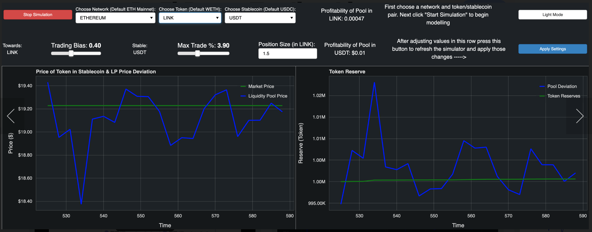

# UniswapPy: Uniswap V2 / V3 Analytics with Python
This package is a python re-factor of the both original Uniswap [V2](https://github.com/Uniswap/v2-core/blob/master/contracts/UniswapV2Pair.sol) and [V3](https://github.com/Uniswap/v3-core/blob/main/contracts/UniswapV3Pool.sol)
pairing codes and can be utilized for the purpose of analysing and modelling its behavior for DeFi

## Docs
Visit [docs](https://defipy.org) for full documentation with walk-through 
tutorials

## Installation 
```
> git clone https://github.com/defipy-devs/uniswappy
> pip install .
```
or
```
> pip install UniswapPy
```

## Uniswap V2

* See [test notebook](https://github.com/icmoore/uniswappy/blob/main/notebooks/tutorials/pairingcode.ipynb) 
for basic usage

```
from uniswappy import *

user_nm = 'user_intro'
eth_amount = 1000
dai_amount = 1000000

dai = ERC20("DAI", "0x111")
eth = ERC20("ETH", "0x09")
exchg_data = UniswapExchangeData(tkn0 = eth, tkn1 = dai, symbol="LP", 
address="0x011")

factory = UniswapFactory("ETH pool factory", "0x2")
lp = factory.deploy(exchg_data)
lp.add_liquidity("user0", eth_amount, dai_amount, eth_amount, dai_amount)
lp.summary()
```

#### OUTPUT:
Exchange ETH-DAI (LP) <br/>
Reserves: ETH = 1000, DAI = 1000000 <br/>
Liquidity: 31622.776601683792 <br/><br/>
```
from uniswappy.process.swap import Swap

out = Swap().apply(lp, dai, user_nm, 1000)
lp.summary()
```

#### OUTPUT:
Exchange ETH-DAI (LP) <br/>
Reserves: ETH = 999.00399301896, DAI = 1001000 <br/>
Liquidity: 31622.776601683792 <br/><br/>


## Uniswap V3

* See [test notebook](https://github.com/defipy-devs/uniswappy/blob/main/notebooks/tutorials/uniswap_v3.ipynb) 
for basic usage

```
from uniswappy import *
from uniswappy.utils.tools.v3 import UniV3Utils 

user = 'test_user'
fee = UniV3Utils.FeeAmount.MEDIUM
tick_spacing = UniV3Utils.TICK_SPACINGS[fee]
lwr_tick = UniV3Utils.getMinTick(tick_spacing)
upr_tick = UniV3Utils.getMaxTick(tick_spacing)
init_price = UniV3Utils.encodePriceSqrt(1, 10)

tkn = ERC20("TKN", "0x111")
dai = ERC20("DAI", "0x09")

exchg_data = UniswapExchangeData(tkn0 = tkn, tkn1 = dai, symbol="LP", 
                                   address="0x011", version = 'V3', 
                                   tick_spacing = tick_spacing, 
                                   fee = fee)

factory = UniswapFactory("TKN pool factory", "0x2")
lp = factory.deploy(exchg_data)
lp.initialize(init_price)
lp.mint(user, lwr_tick, upr_tick, 3161)
lp.summary()
```

#### OUTPUT:
Exchange TKN-DAI (LP) <br/>
Reserves: TKN = 9996, DAI = 1000 <br/>
Liquidity: 3161 <br/><br/>

## 0x Quant Terminal

This application utilizes the 0x API to produce a mock Uniswap pool which allows end-users to stress test
the limitations of a Uniswap pool setup using live price feeds from [0x API](https://0x.org); for backend setup, see 
[notebook](https://github.com/defipy-devs/uniswappy/blob/main/notebooks/tutorials/quant_terminal.ipynb) 

Click [dashboard.defipy.org](https://dashboard.defipy.org/) for live link; for more detail see 
[README](https://github.com/defipy-devs/uniswappy/tree/main/python/application/quant_terminal#readme) 



### Run application locally  

```
> bokeh serve --show python/application/quant_terminal/bokeh_server.py
```

## Special Features
 * **Abstracted Actions**: Obfuscation is removed from standard Uniswap 
action events to help streamline analysis and lower line count; see 
article [How to Handle Uniswap Withdrawals like an 
OG](https://medium.com/coinmonks/handle-uniswap-withdrawals-like-an-og-389fe74be18c), 
and [Setup your Uniswap Deposits like a 
Baller](https://medium.com/coinmonks/setup-your-uniswap-deposits-like-a-baller-b99340ea302f)
 * **Indexing**: Can calculate settlment LP token amounts given token 
amounts and vice versa; see article [The Uniswap Indexing 
Problem](https://medium.com/datadriveninvestor/the-uniswap-indexing-problem-8078b8b110fc)
 * **Simulation**: Can simulate trading using Geometric Brownian Motion 
(GBM) process, or feed in actual raw price data to analyze behavior; see 
article [How to Simulate a Liquidity Pool for Decentralized 
Finance](https://medium.com/@icmoore/simulating-a-liquidity-pool-for-decentralized-finance-6f357ec8564b)
 * **Randomized Events**: Token amount and time delta models to simulate 
possible trading behavior
 * **Analytical Tools**: Basic yeild calculators and risk tools to assist 
in analyzing outcomes
 
 

